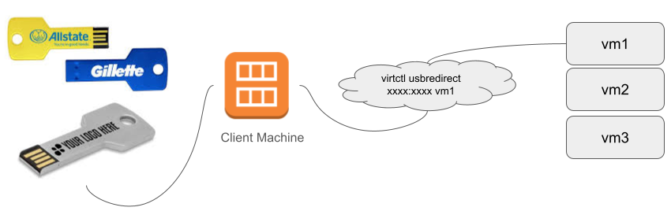
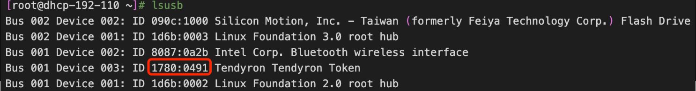
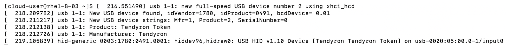
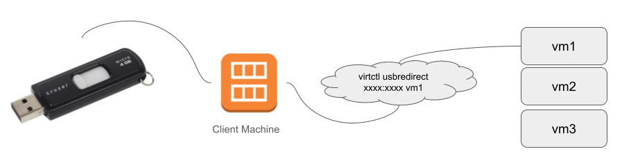
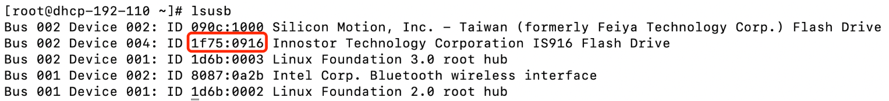

# OpenShift Virtualization Day2 Administration
Quick Start Administrative Guide


# Table of Contents
- [OpenShift Virtualization Day2 Administration](#openshift-virtualization-day2-administration)
- [Table of Contents](#table-of-contents)
- [About this document](#about-this-document)
  - [Disclaimer](#disclaimer)
  - [Purpose of this document](#purpose-of-this-document)
- [Day 2 operation content](#day-2-operation-content)
- [Basic concept and definition of Openshift virtualization](#basic-concept-and-definition-of-openshift-virtualization)
- [OpenShift Virtualization Deployment Architecture](#openshift-virtualization-deployment-architecture)
- [ Monitoring ](#-monitoring-)
  - [ Querying metrics ](#-querying-metrics-)
    - [Querying metrics for all projects as a cluster administrator](#querying-metrics-for-all-projects-as-a-cluster-administrator)
  - [Alert and related runbook](#alert-and-related-runbook)
- [VM Management](#vm-management)
  - [Starting a VM](#starting-a-vm)
  - [VM creation](#vm-creation)
    - [Import VM from existing](#import-vm-from-existing)
    - [Create VM from template](#create-vm-from-template)
  - [VM monitoring](#vm-monitoring)
      - [ vCPU metrics](#vcpu-metrics)
      - [Network metrics](#network-metrics)
      - [Storage metrics](#storage-metrics)
        - [Storage-related traffic](#storage-related-traffic)
        - [Storage snapshot data](#storage-snapshot-data)
        - [ I/O performance](#io-performance)
      - [Guest memory swapping metrics](#guest-memory-swapping-metrics)
    - [Exposing custom metrics for virtual machines](#exposing-custom-metrics-for-virtual-machines)
  - [Delete/Destroy VM](#deletedestroy-vm)
- [Node Manangement](#node-manangement)
  - [What metrics we should monitor](#what-metrics-we-should-monitor)
  - [How to monitor the Node metrics](#how-to-monitor-the-node-metrics)
  - [How to add new nodes to cluster when lacking resource](#how-to-add-new-nodes-to-cluster-when-lacking-resource)
    - [Actions after adding nodes](#actions-after-adding-nodes)
  - [How to controle VM migration when mantaining nodes](#how-to-controle-vm-migration-when-mantaining-nodes)
- [Storage Management](#storage-management)
  - [Storage trouble shooting](#storage-trouble-shooting)
    - [ODF StorageSystemDegraded](#odf-storagesystemdegraded)
    - [ODF SlowOperations](#odf-slowoperations)
    - [HPE CSI Driver Diagnostics](#hpe-csi-driver-diagnostics)
      - [HPE Alletra MP StorageClass](#hpe-alletra-mp-storageclass)
- [Network](#network)
  - [Verify network connectivity and measures latency between two VM attached to a secondary network interface.(Technical Preview feature)](#verify-network-connectivity-and-measures-latency-between-two-vm-attached-to-a-secondary-network-interfacetechnical-preview-feature)
    - [Prerequisites](#prerequisites)
    - [Procedure](#procedure)
- [Live migration , Backup restore and DR related topic](#live-migration--backup-restore-and-dr-related-topic)
  - [Live migration](#live-migration)
    - [Live migration metrics](#live-migration-metrics)
- [Openshift virtualization upgrade](#openshift-virtualization-upgrade)
- [USB device passthrough](#usb-device-passthrough)
  - [Redirectly local USB key to remote VM](#redirectly-local-usb-key-to-remote-vm)
    - [1. Enable VM to support client passthrough feature](#1-enable-vm-to-support-client-passthrough-feature)
    - [2. Start VM](#2-start-vm)
    - [3. Login remote VM consle and check USB devices](#3-login-remote-vm-consle-and-check-usb-devices)
    - [4. Plug the USB ken in local host and check the USB device ID](#4-plug-the-usb-ken-in-local-host-and-check-the-usb-device-id)
    - [5. passthough the USB key](#5-passthough-the-usb-key)
    - [6.  you could see the message show in vm console](#6--you-could-see-the-message-show-in-vm-console)
  - [Redirectly local USB Disk to remote VM](#redirectly-local-usb-disk-to-remote-vm)
    - [1. Enable VM to support client passthrough feature](#1-enable-vm-to-support-client-passthrough-feature-1)
    - [2. Start VM](#2-start-vm-1)
    - [3. Login remote VM consle and check USB devices](#3-login-remote-vm-consle-and-check-usb-devices-1)
    - [4. Plug the USB disk in local host and check the USB device ID](#4-plug-the-usb-disk-in-local-host-and-check-the-usb-device-id)
    - [5. passthough the USB disk](#5-passthough-the-usb-disk)
    - [6. check the message from your vm console](#6-check-the-message-from-your-vm-console)
    - [7. mount USB disk in VM console](#7-mount-usb-disk-in-vm-console)
- [Trouble shooting](#trouble-shooting)


# About this document
## Disclaimer

* This guide intends to provide non-kubernetes administrators with quick start administrative guide on OpenShift Virtualization.
* This guide will complement OpenShift documentation with quick access for particular administrative scenario.
* This guide isn’t used to replace any Red Hat knowledgebase or  OpenShift documentation.
* This guide doesn’t provide OpenShift day0 or features installation or configuration.
* This document is based on Openshift 4.15 and baremetal infrastructure
## Purpose of this document
This document serves as a comprehensive guide for IT administrators on the Day 2 operations of OpenShift virtualization. It aims to provide detailed insights, instructions, and best practices for managing OpenShift virtualized environments post-deployment.

The primary purpose of this document is to empower IT administrators with the knowledge and tools necessary to effectively operate and maintain OpenShift virtualization infrastructure. By understanding the Day 2 operations, administrators can ensure the smooth functioning, performance optimization, and scalability of their OpenShift virtualized environments.
# Day 2 operation content
Comparing day 0 planning, day 1 deploying, yes, day-2 is the stuff that happens after deployment. The fun stuff is over. Celebrations over a 'successful delivery' are behind you. It's time to embrace reality for a while, at least until you start all over again.

**Day-2 operations tasks include:**
- Manage the VM lifecycle
- Monitoring VM status to prevent and respond to problems
- Monitoring the computing, memory, network and storage performance and capacity 
- Performing routine maintenance like backups and restores
- Restoring service if infrastructure fails, through spinning up new infrastructure or doing rollbacks
- Patch and upgrade the VM
- Patch and upgrade the infrastructure node, storage and etc.
You can sum up day-2 operations as 'business as usual' operations tasks. It's the phase that keeps your product ticking over so your end user can enjoy it when they need it.

# Basic concept and definition of Openshift virtualization

# OpenShift Virtualization Deployment Architecture
This quick start administrative guide is based on 3 compact nodes OpenShift architecture as shown below. The administrative guidance shall be practical to all OpenShift deployment architecture


# <span id="monitor"> Monitoring </span> 
OpenShift Container Platform includes a preconfigured, preinstalled, and self-updating monitoring stack based on Prometheus, Grafana, and Kubernetes-native monitoring components that provides monitoring for core platform components, and delivers monitoring best practices out of the box.

In the **Observe** section of OpenShift Container Platform web console, you can access and manage monitoring features such as metrics, alerts, monitoring dashboards, and metrics targets.

## <span id="qmetrics"> Querying metrics </span>
The OpenShift Container Platform monitoring dashboard enables you to run [Prometheus Query Language (PromQL) queries](https://prometheus.io/docs/prometheus/latest/querying/basics/) to examine metrics visualized on a plot. This functionality provides information about the state of a cluster and any user-defined workloads that you are monitoring.

As a cluster administrator, you can query metrics for all core OpenShift Container Platform and user-defined projects.

As a developer, you must specify a project name when querying metrics. You must have the required privileges to view metrics for the selected project.

### Querying metrics for all projects as a cluster administrator
As a cluster administrator or as a user with view permissions for all projects, you can access metrics for all default OpenShift Container Platform and user-defined projects in the Metrics UI.

**Prerequisites**

- You have access to the cluster as a user with the `cluster-admin` cluster role or with view permissions for all projects.
- You have installed the OpenShift CLI (`oc`).

**Procedure**

1. From the **Administrator** perspective in the OpenShift Container Platform web console, select **Observe** → **Metrics**.
2. To add one or more queries, do any of the following:

| Option                          | Description                                                                                                                                                                                                                                                                                                                                                                                                                                                                         |
| :------------------------------ | :---------------------------------------------------------------------------------------------------------------------------------------------------------------------------------------------------------------------------------------------------------------------------------------------------------------------------------------------------------------------------------------------------------------------------------------------------------------------------------- |
| Create a custom query.          | Add your Prometheus Query Language (PromQL) query to the **Expression** field.<br><br>As you type aPromQL expression, autocomplete suggestions appear in a drop-down list. These suggestions include functions, metrics,labels, and time tokens. You can use the keyboard arrows to select one of these suggested items and then press Enter to addthe item to your expression. You can also move your mouse pointer over a suggested item to view a brief description of thatitem. |
| Add multiple queries.           | Select **Add query**.                                                                                                                                                                                                                                                                                                                                                                                                                                                               |
| Duplicate an existing query.    | Select the Options menu  next to the query,then choose **Duplicate query**.                                                                                                                                                                                                                                                                                                                                                                                                         |
| Disable a query from being run. | Select the Options menu  next to the queryand choose **Disable query**.                                                                                                                                                                                                                                                                                                                                                                                                             |

3. To run queries that you created, select **Run queries**. The metrics from the queries are visualized on the plot. If a query is invalid, the UI shows an error message.
4.  Optional: The page URL now contains the queries you ran. To use this set of queries again in the future, save this URL.
5. Explore the visualized metrics. Initially, all metrics from all enabled queries are shown on the plot. You can select which metrics are shown by doing any of the following:

| Option                                                       | Description                                                                                                                                                            |
| :----------------------------------------------------------- | :--------------------------------------------------------------------------------------------------------------------------------------------------------------------- |
| Hide all metrics from a query.                               | Click the Options menu  for the query andclick **Hide all series**.                                                                                                    |
| Hide a specific metric.                                      | Go to the query table and click the colored square near the metric name.                                                                                               |
| Zoom into the plot and change the time range.                | Either:<br><br>- Visually select the time range by clicking and dragging onthe plot horizontally.<br>- Use the menu in the left upper corner to select the time range. |
| Reset the time range.                                        | Select **Reset zoom**.                                                                                                                                                 |
| Display outputs for all queries at a specific point in time. | Hold the mouse cursor on the plot at that point. The queryoutputs will appear in a pop-up box.                                                                         |
| Hide the plot.                                               | Select **Hide graph**.                                                                                                                                                 |

## Alert and related runbook
OpenShift Virtualization alerts are displayed on the **Virtualization** → **Overview** → [**Overview** tab](https://access.redhat.com/documentation/en-us/openshift_container_platform/4.15/html/virtualization/getting-started#overview-overview_virt-web-console-overview "3.3.1.1. Overview tab") in the web console.

You can use the procedures in **[OpenShift Virtualization runbooks](https://access.redhat.com/documentation/en-us/openshift_container_platform/4.15/html/virtualization/monitoring#virt-runbooks)**  to diagnose and resolve issues that trigger OpenShift Virtualization [alerts](https://access.redhat.com/documentation/en-us/openshift_container_platform/4.15/html-single/monitoring/#managing-alerts).

# VM Management
Full lifecycle mangement from creation, running, upgrading to deleting 
## Starting a VM

Stoping a  VM

Restarting a VM

Pausing a VM

Unpausing a VM

## VM creation
### Import VM from existing 

### Create VM from template
How to standard enterprise VM

## VM monitoring
To monitor mission critical VM instance or  trouble shoot , through the integrated [Openshift Monitoring stack](#monitor), admin could monitor the vCPU, memory, network, and storage metrics .
####  vCPU metrics

The following query can identify virtual machines that are waiting for Input/Output (I/O):

`kubevirt_vmi_vcpu_wait_seconds_total`

Returns the wait time (in seconds) for a virtual machine’s vCPU. Type: Counter.

A value above '0' means that the vCPU wants to run, but the host scheduler cannot run it yet. This inability to run indicates that there is an issue with I/O.

**Example vCPU wait time query**
```
topk(3, sum by (name, namespace) (rate(kubevirt_vmi_vcpu_wait_seconds_total[6m]))) > 0 
```
This query returns the top 3 VMs waiting for I/O at every given moment over a six-minute time period.
#### Network metrics

The following queries can identify virtual machines that are saturating the network:

`kubevirt_vmi_network_receive_bytes_total`

Returns the total amount of traffic received (in bytes) on the virtual machine’s network. Type: Counter.

`kubevirt_vmi_network_transmit_bytes_total`

Returns the total amount of traffic transmitted (in bytes) on the virtual machine’s network. Type: Counter.

**Example network traffic query**
```
topk(3, sum by (name, namespace) (rate(kubevirt_vmi_network_receive_bytes_total[6m])) + sum by (name, namespace) (rate(kubevirt_vmi_network_transmit_bytes_total[6m]))) > 0 
```
This query returns the top 3 VMs transmitting the most network traffic at every given moment over a six-minute time period.
#### Storage metrics

<todo>ToDo: how to monitor the vm storage utilization</todo>

##### Storage-related traffic

The following queries can identify VMs that are writing large amounts of data:

`kubevirt_vmi_storage_read_traffic_bytes_total`

Returns the total amount (in bytes) of the virtual machine’s storage-related traffic. Type: Counter.

`kubevirt_vmi_storage_write_traffic_bytes_total`

Returns the total amount of storage writes (in bytes) of the virtual machine’s storage-related traffic. Type: Counter.

**Example storage-related traffic query**
```
topk(3, sum by (name, namespace) (rate(kubevirt_vmi_storage_read_traffic_bytes_total[6m])) + sum by (name, namespace) (rate(kubevirt_vmi_storage_write_traffic_bytes_total[6m]))) > 0 
```
This query returns the top 3 VMs performing the most storage traffic at every given moment over a six-minute time period.
##### Storage snapshot data

`kubevirt_vmsnapshot_disks_restored_from_source`

Returns the total number of virtual machine disks restored from the source virtual machine. Type: Gauge.

`kubevirt_vmsnapshot_disks_restored_from_source_bytes`

Returns the amount of space in bytes restored from the source virtual machine. Type: Gauge.

**Examples of storage snapshot data queries**
```
kubevirt_vmsnapshot_disks_restored_from_source{vm_name="simple-vm", vm_namespace="default"} 
```
This query returns the total number of virtual machine disks restored from the source virtual machine.
```
kubevirt_vmsnapshot_disks_restored_from_source_bytes{vm_name="simple-vm", vm_namespace="default"} 
```
This query returns the amount of space in bytes restored from the source virtual machine.
#####  I/O performance

The following queries can determine the I/O performance of storage devices:

`kubevirt_vmi_storage_iops_read_total`

Returns the amount of write I/O operations the virtual machine is performing per second. Type: Counter.

`kubevirt_vmi_storage_iops_write_total`

Returns the amount of read I/O operations the virtual machine is performing per second. Type: Counter.

**Example I/O performance query**
```
topk(3, sum by (name, namespace) (rate(kubevirt_vmi_storage_iops_read_total[6m])) + sum by (name, namespace) (rate(kubevirt_vmi_storage_iops_write_total[6m]))) > 0 
```
This query returns the top 3 VMs performing the most I/O operations per second at every given moment over a six-minute time period.
#### Guest memory swapping metrics

Memory swapping indicates that the virtual machine is under memory pressure. Increasing the memory allocation of the virtual machine can mitigate this issue.

The following queries can identify which swap-enabled guests are performing the most memory swapping:

`kubevirt_vmi_memory_swap_in_traffic_bytes`

Returns the total amount (in bytes) of memory the virtual guest is swapping in. Type: Gauge.

`kubevirt_vmi_memory_swap_out_traffic_bytes`

Returns the total amount (in bytes) of memory the virtual guest is swapping out. Type: Gauge.

**Example memory swapping query**
```
topk(3, sum by (name, namespace) (rate(kubevirt_vmi_memory_swap_in_traffic_bytes[6m])) + sum by (name, namespace) (rate(kubevirt_vmi_memory_swap_out_traffic_bytes[6m]))) > 0 
```
This query returns the top 3 VMs where the guest is performing the most memory swapping at every given moment over a six-minute time period.

###  Exposing custom metrics for virtual machines
In addition to using the OpenShift Container Platform monitoring stack, you can enable monitoring for user-defined projects by using the CLI and query custom metrics that are exposed for virtual machines through the `node-exporter` service.
1. Deploy node-export agent on every virtual machine from which you want to collect metrics.  Download the `node-exporter` file on to the virtual machine. Then, create a `systemd` service that runs the node-exporter service when the virtual machine boots.
2.  Creating a custom monitoring label for virtual machines
3.  Configure the node-exporter agent as a service to expose internal metrics and processes that are associated with virtual machines.

**ADDITIONAL RESOURCES:**
- **[Steps exposing custom metrics for virtual machines](https://access.redhat.com/documentation/en-us/openshift_container_platform/4.15/html/virtualization/monitoring#virt-exposing-custom-metrics-for-vms)**
- [Configuring the monitoring stack](https://access.redhat.com/documentation/en-us/openshift_container_platform/4.15/html-single/monitoring/#configuring-the-monitoring-stack)
- [Enabling monitoring for user-defined projects](https://access.redhat.com/documentation/en-us/openshift_container_platform/4.15/html-single/monitoring/#enabling-monitoring-for-user-defined-projects)
- [Managing metrics](https://access.redhat.com/documentation/en-us/openshift_container_platform/4.15/html-single/monitoring/#managing-metrics)
- [Reviewing monitoring dashboards](https://access.redhat.com/documentation/en-us/openshift_container_platform/4.15/html-single/monitoring/#reviewing-monitoring-dashboards)


## Delete/Destroy VM


# Node Manangement
Suppose we selected right resource allocation method,  such as node selector, affinity, taint , to schedule the VM workload to the available nodes.  In day 2 operation, the SRE should monitor the node formance and capactity to make sure the cluster have enough resouce to run VM.
## What metrics we should monitor

- Phycisal CPU unitilization
- Phycisal Memory Unitilization
- Requested rerource 
- Limited resource (overcommit)

## How to monitor the Node metrics

## How to add new nodes to cluster when lacking resource
 [Scaling a user-provisioned cluster with the Bare Metal Operator](https://access.redhat.com/documentation/en-us/openshift_container_platform/4.15/html/installing/installing-on-bare-metal#about-scaling-a-user-provisioned-cluster-with-the-bare-metal-operator_scaling-a-user-provisioned-cluster-with-the-bare-metal-operator)

### Actions after adding nodes
-  Label the nodes if the VM is scheduled through node selector
-  taint the nodes if the nodes are dedicated for special workload 


## How to controle VM migration when mantaining nodes
Use **Eviction strategies** control the VM migration

# Storage Management
How to monitor and resize the storage capactiy and performance 
- ODF
- HPE
- DELL
- the others 
- 

## Storage trouble shooting
Use a predefined [storage checkup](https://access.redhat.com/documentation/en-us/openshift_container_platform/4.15/html/virtualization/monitoring#virt-checking-storage-configuration_virt-running-cluster-checkups) to verify that the OpenShift Container Platform cluster storage is configured optimally to run OpenShift Virtualization workloads.

To list available storageclass
```
$oc get storageclass
```

To make the desired storageclass the default
```
$oc patch storageclass ocs-storagecluster-ceph-rbd-virtualization -p ‘{“metadata”: {“annotations”: {“storageclass.kubernetes.io/is-default-class”: “true”}}}’
```

To remove the default storageclass setting from the old default storageclass
```
$oc patch storageclass hpe-standard -p ‘{“metadata”: {“annotations”: {“storageclass.kubernetes.io/is-default-class”: “false”}}}’
```

### ODF StorageSystemDegraded
Due to node deleted scenario. The label of openshift-storage has been removed from deleted node. Re-label openshift-storage to the deleted node that have rebooted.
```
$oc label node <node_name> cluster.ocs.openshift.io/openshift-storage=’’
```

Run Ceph status and ceph osd tree to see that status of the Ceph cluster
```
$oc rsh -n openshift-storage $(oc get pods -n openshift-storage -o name -l app=rook-ceph-operator)
sh-5.1$export CEPH_ARGS=’-c /var/lib/rook/openshift-storage/openshift-storage.config’
sh-5.1$ceph status
sh-5.1$ceph osd tree 
```

Read and acknowledge Ceph alert message
1. Display list of message
 ```
 sh-5.1$ ceph crash ls
 ```  
2. Read the message
  ```
  sh-5.1$ ceph crash info <id>
  ```
3. Acknowledge the message
  ```
  sh-5.1$ ceph crash archive <id>
  ```

### ODF SlowOperations
Sometimes StorageSystem degraded due to slow operations on mon without errors or all OSDs are up as shown below
```
$ ceph -s
cluster:
  id:     ba41ac93-3b55-4f32-9e06-d3d8c6ff7334
  health: HEALTH_WARN
          30 slow ops, oldest one blocked for 10624 sec, mon.a has slow ops
[...]
```

Ceph Mon.a is safely restarted to resolve StorageSystem dedgraded
```
oc scale --replicas=0 deploy/rook-ceph-mon-a
oc scale --replicas=1 deploy/rook-ceph-mon-a
```

Verify Mon.a is restarted
```
oc get pods -l app=rook-ceph-mon-a
```

### HPE CSI Driver Diagnostics

Verify HPE Alletra StorageMP pods are running
```
$oc get pods –all-namespaces -l ‘app in (primera3par-csp, hpe-csi-node, hpe-csi-controller)’
```

Verify CRD named hpenodeinfos.storage.hpe.com holds important network and host initiator information
```
$oc get hpenodeinfos
```

Inspect a node
```
$oc get hpenodeinfos/<worker_node> -o yaml
```

Inspect CSI node driver
```
$oc logs -f daemonset.apps/hpe-csi-node hpe-csi-driver -n hpe-storage
```

Inspect CSI controller driver
```
$oc logs -f deployment.apps/hpe-csi-controller hpe-csi-driver -n hpe-storage
```

Example missing CSP error messages from Primera3par as shown 
```
level=error msg="unable to connect to 192.168.X.X: dial tcp 192.168.X.X:22: connect: connection timed out\n" file="hpe_ssh.go:92"
level=error msg="Non-CSP panic received: &hpessh.HpeSshErrorContext{RespBody:[]uint8(nil), ErrCode:1000, Err:(*errors.errorString)(0xc00023ac80)}\n" file="csp_manager.go:49"
```

#### HPE Alletra MP StorageClass 
HPE Alletra MP StorageClass add **cpg parameter** as follows
```
  kind: StorageClass \n
  apiVersion: storage.k8s.io/v1
  metadata:
    name: hpe-standard
  provisioner: csi.hpe.com
  parameters:
    csi.storage.k8s.io/fstype: xfs
    csi.storage.k8s.io/provisioner-secret-namespace: hpe-storage
    csi.storage.k8s.io/provisioner-secret-name: hpe-backend
    csi.storage.k8s.io/node-stage-secret-name: hpe-backend
    csi.storage.k8s.io/controller-expand-secret-name: hpe-backend
    csi.storage.k8s.io/node-publish-secret-namespace: hpe-storage
    csi.storage.k8s.io/controller-publish-secret-name: hpe-backend
    csi.storage.k8s.io/controller-publish-secret-namespace: hpe-storage
    hostSeesVLUN: 'true'
    csi.storage.k8s.io/node-publish-secret-name: hpe-backend
    csi.storage.k8s.io/controller-expand-secret-namespace: hpe-storage
    cpg: RHOSP_CPG        <----- Change this to created storage pool name in SAN
    accessProtocol: fc    <----- Change this value if other than FC connection
    description: Volume created by the HPE CSI Driver for kubernetes
    csi.storage.k8s.io/node-stage-secret-namespace: hpe-storage
  reclaimPolicy: Delete
  allowVolumeExpansion: true
  volumeBindingMode: Immediate
```
**HPE CSI Change Username or Password**

Verify existing HPE CSI secret file
```
$oc get secret -n hpe-storage
```

Delete existing HPE CSI secret file
```
$oc delete secret/<hpe_backend> -n hpe-storage
```

Edit HPE CSI secret YAML file to reflect username or password changed
```
apiVersion: v1
kind: secret
metadata
  name: hpe-backend
  namespace: hpe-storage
stringData: 
  serviceName: alletrastoragemp-csp-svc
  servicePort: “8080”
  backend: <SAN_IP_address>
  username: <username>
  password: <password>
```

Create new HPE CSI secret
```
$oc create -f <hpe_csi_secret>
```

Restart HPE CSI objects to reflect the changes
```
$oc rollout ds restart -n hpe-storage
$oc rollout deploy restart -n hpe-storage
```

# Network


## Verify network connectivity and measures latency between two VM attached to a secondary network interface.(Technical Preview feature)
A checkup is an automated test workload that allows you to verify if a specific cluster functionality works as expected. The cluster checkup framework uses native Kubernetes resources to configure and execute the checkup.

By using predefined checkups, cluster administrators and developers can improve cluster maintainability, troubleshoot unexpected behavior, minimize errors, and save time. They can also review the results of the checkup and share them with experts for further analysis. Vendors can write and publish checkups for features or services that they provide and verify that their customer environments are configured correctly.

You use a predefined checkup to verify network connectivity and measure latency between two virtual machines (VMs) that are attached to a secondary network interface. The latency checkup uses the ping utility.

<todo>ToDo: from the document, it checks two node latency, need to practice this procedure to verify how to check the two VM latency and update this section</todo>

### Prerequisites
You must add a `NetworkAttachmentDefinition` to the namespace.

### Procedure
You run a latency checkup by performing the following steps:

1. Create a service account, roles, and rolebindings to provide cluster access permissions to the latency checkup.

2. Create a config map to provide the input to run the checkup and to store the results.

3. Create a job to run the checkup.

4. Review the results in the config map.

5. Optional: To rerun the checkup, delete the existing config map and job and then create a new config map and job.

6. When you are finished, delete the latency checkup resources.

Prerequisites
- You installed the OpenShift CLI (oc).

- The cluster has at least two worker nodes.

- You configured a network attachment definition for a namespace.

Procedure
1. Create a ServiceAccount, Role, and RoleBinding manifest for the latency checkup:

Collapse all
Example role manifest file

```yaml
---
apiVersion: v1
kind: ServiceAccount
metadata:
  name: vm-latency-checkup-sa
---
apiVersion: rbac.authorization.k8s.io/v1
kind: Role
metadata:
  name: kubevirt-vm-latency-checker
rules:
- apiGroups: ["kubevirt.io"]
  resources: ["virtualmachineinstances"]
  verbs: ["get", "create", "delete"]
- apiGroups: ["subresources.kubevirt.io"]
  resources: ["virtualmachineinstances/console"]
  verbs: ["get"]
- apiGroups: ["k8s.cni.cncf.io"]
  resources: ["network-attachment-definitions"]
  verbs: ["get"]
---
apiVersion: rbac.authorization.k8s.io/v1
kind: RoleBinding
metadata:
  name: kubevirt-vm-latency-checker
subjects:
- kind: ServiceAccount
  name: vm-latency-checkup-sa
roleRef:
  kind: Role
  name: kubevirt-vm-latency-checker
  apiGroup: rbac.authorization.k8s.io
---
apiVersion: rbac.authorization.k8s.io/v1
kind: Role
metadata:
  name: kiagnose-configmap-access
rules:
- apiGroups: [ "" ]
  resources: [ "configmaps" ]
  verbs: ["get", "update"]
---
apiVersion: rbac.authorization.k8s.io/v1
kind: RoleBinding
metadata:
  name: kiagnose-configmap-access
subjects:
- kind: ServiceAccount
  name: vm-latency-checkup-sa
roleRef:
  kind: Role
  name: kiagnose-configmap-access
  apiGroup: rbac.authorization.k8s.io
```
Apply the ServiceAccount, Role, and RoleBinding manifest:


```
$ oc apply -n <target_namespace> -f <latency_sa_roles_rolebinding>.yaml 
```

<target_namespace> is the namespace where the checkup is to be run. This must be an existing namespace where the NetworkAttachmentDefinition object resides.

3. Create a ConfigMap manifest that contains the input parameters for the checkup:

Example input config map

```yaml
apiVersion: v1
kind: ConfigMap
metadata:
  name: kubevirt-vm-latency-checkup-config
  labels:
    kiagnose/checkup-type: kubevirt-vm-latency
data:
  spec.timeout: 5m
  spec.param.networkAttachmentDefinitionNamespace: <target_namespace>
  spec.param.networkAttachmentDefinitionName: "blue-network" 
  spec.param.maxDesiredLatencyMilliseconds: "10" 
  spec.param.sampleDurationSeconds: "5" 
  spec.param.sourceNode: "worker1" 
  spec.param.targetNode: "worker2" 
```
The name of the NetworkAttachmentDefinition object.
- Optional: The maximum desired latency, in milliseconds, between the virtual machines. If the measured latency exceeds this value, the checkup fails.
- Optional: The duration of the latency check, in seconds.
- Optional: When specified, latency is measured from this node to the target node. If the source node is specified, the spec.param.targetNode field cannot be empty.
- Optional: When specified, latency is measured from the source node to this node.

4. Apply the config map manifest in the target namespace:

```shell
$ oc apply -n <target_namespace> -f <latency_config_map>.yaml
```
5. Create a Job manifest to run the checkup:

Example job manifest
```yaml
apiVersion: batch/v1
kind: Job
metadata:
  name: kubevirt-vm-latency-checkup
  labels:
    kiagnose/checkup-type: kubevirt-vm-latency
spec:
  backoffLimit: 0
  template:
    spec:
      serviceAccountName: vm-latency-checkup-sa
      restartPolicy: Never
      containers:
        - name: vm-latency-checkup
          image: registry.redhat.io/container-native-virtualization/vm-network-latency-checkup-rhel9:v4.15.0
          securityContext:
            allowPrivilegeEscalation: false
            capabilities:
              drop: ["ALL"]
            runAsNonRoot: true
            seccompProfile:
              type: "RuntimeDefault"
          env:
            - name: CONFIGMAP_NAMESPACE
              value: <target_namespace>
            - name: CONFIGMAP_NAME
              value: kubevirt-vm-latency-checkup-config
            - name: POD_UID
              valueFrom:
                fieldRef:
                  fieldPath: metadata.uid
```
6. Apply the Job manifest:

```shell
$ oc apply -n <target_namespace> -f <latency_job>.yaml
```
7. Wait for the job to complete:

```
$ oc wait job kubevirt-vm-latency-checkup -n <target_namespace> --for condition=complete --timeout 6m
```
8. Review the results of the latency checkup by running the following command. If the maximum measured latency is greater than the value of the `spec.param.maxDesiredLatencyMilliseconds` attribute, the checkup fails and returns an error.

```
$ oc get configmap kubevirt-vm-latency-checkup-config -n <target_namespace> -o yaml
```
Example output config map (success)

```yaml
apiVersion: v1
kind: ConfigMap
metadata:
  name: kubevirt-vm-latency-checkup-config
  namespace: <target_namespace>
  labels:
    kiagnose/checkup-type: kubevirt-vm-latency
data:
  spec.timeout: 5m
  spec.param.networkAttachmentDefinitionNamespace: <target_namespace>
  spec.param.networkAttachmentDefinitionName: "blue-network"
  spec.param.maxDesiredLatencyMilliseconds: "10"
  spec.param.sampleDurationSeconds: "5"
  spec.param.sourceNode: "worker1"
  spec.param.targetNode: "worker2"
  status.succeeded: "true"
  status.failureReason: ""
  status.completionTimestamp: "2022-01-01T09:00:00Z"
  status.startTimestamp: "2022-01-01T09:00:07Z"
  status.result.avgLatencyNanoSec: "177000"
  status.result.maxLatencyNanoSec: "244000" 
  status.result.measurementDurationSec: "5"
  status.result.minLatencyNanoSec: "135000"
  status.result.sourceNode: "worker1"
  status.result.targetNode: "worker2"
```
The maximum measured latency in nanoseconds.

9. Optional: To view the detailed job log in case of checkup failure, use the following command:
```
$ oc logs job.batch/kubevirt-vm-latency-checkup -n <target_namespace>
```
10. Delete the job and config map that you previously created by running the following commands:

```shell
$ oc delete job -n <target_namespace> kubevirt-vm-latency-checkup

$ oc delete config-map -n <target_namespace> kubevirt-vm-latency-checkup-config
```

11. Optional: If you do not plan to run another checkup, delete the roles manifest:

```
$ oc delete -f <latency_sa_roles_rolebinding>.yaml
```


# Live migration , Backup restore and DR related topic
## Live migration
### Live migration metrics

From the [Openshift metrics console](#Querying metrics) , the following metrics can be queried to show live migration status :

`kubevirt_vmi_migration_data_processed_bytes`

The amount of guest operating system data that has migrated to the new virtual machine (VM). Type: Gauge.

`kubevirt_vmi_migration_data_remaining_bytes`

The amount of guest operating system data that remains to be migrated. Type: Gauge.

`kubevirt_vmi_migration_memory_transfer_rate_bytes`

The rate at which memory is becoming dirty in the guest operating system. Dirty memory is data that has been changed but not yet written to disk. Type: Gauge.

`kubevirt_vmi_migrations_in_pending_phase`

The number of pending migrations. Type: Gauge.

`kubevirt_vmi_migrations_in_scheduling_phase`

The number of scheduling migrations. Type: Gauge.

`kubevirt_vmi_migrations_in_running_phase`

The number of running migrations. Type: Gauge.

`kubevirt_vmi_migration_succeeded`

The number of successfully completed migrations. Type: Gauge.

`kubevirt_vmi_migration_failed`

The number of failed migrations. Type: Gauge.


# Openshift virtualization upgrade
# USB device passthrough 
[**KubeVirt Client Passthrough**](https://kubevirt.io/user-guide/compute/client_passthrough/)

KubeVirt included support for redirecting devices from the client's machine to the VMI with the support of virtctl command. The virtctl command uses an application called [usbredirect](https://gitlab.freedesktop.org/spice/usbredir/) to handle client's USB device by unplugging the device from the Client OS and channeling the communication between the device and the VMI.

The usbredirect binary comes from the [usbredir](https://gitlab.freedesktop.org/spice/usbredir/) project and is supported by most Linux distros. You can either fetch the [latest release](https://www.spice-space.org/download/usbredir/) or [MSI installer](https://www.spice-space.org/download/windows/usbredirect/) for Windows support.

Download and install teh usbdirect before run `virtctl usbredir` .
## Redirectly local USB key to remote VM
Some application need USB key to authenticate the user or license. If the application is running in VM, the user access or start the application from remote client, the end user should plug the UBS Key in the local client, then redrect the USB Key to remote VM and let the application access the USB Key as it plugged in the VM.

### 1. Enable VM to support client passthrough feature
Support for redirection of client's USB device was introduced in release v0.44. This feature is not enabled by default. To enable it, add an empty clientPassthrough under devices.
```yaml
spec:
  domain:
    devices:
      clientPassthrough: {}
```
Sample:
```powershell
oc patch vm/rhel-8-03 --type=merge -p '{"spec":{"template":{"spec":{"domain":{"devices":{"clientPassthrough": {}}}}}}}'
```
### 2. Start VM
```shell
$ virtctl restart rhel-8-03
$ oc get vm rhel-8-03 
NAME        AGE   STATUS    READY
rhel-8-03   41d   Running   True
```

### 3. Login remote VM consle and check USB devices
```shell
$ virtctl console rhel-8-03
```
Run 'sudo ls /sys/bus/usb/devices -l" in the remote console to check VM's USB devices.
### 4. Plug the USB ken in local host and check the USB device ID


### 5. passthough the USB key
```shell
$ sudo virtctl usbredir 1780:0491 rhel-8-03 
Password:
{"component":"","level":"info","msg":"port_arg: 'localhost:62945'","pos":"usbredir.go:158","timestamp":"2024-06-20T07:06:52.940778Z"}
{"component":"","level":"info","msg":"args: '[--device 1780:0491 --to localhost:62945]'","pos":"usbredir.go:159","timestamp":"2024-06-20T07:06:52.940878Z"}
{"component":"","level":"info","msg":"Executing commandline: 'usbredirect [--device 1780:0491 --to localhost:62945]'","pos":"usbredir.go:160","timestamp":"2024-06-20T07:06:52.940889Z"}
{"component":"","level":"info","msg":"Connected to usbredirect at 432.849704ms","pos":"usbredir.go:127","timestamp":"2024-06-20T07:06:53.373639Z"}
```
### 6.  you could see the message show in vm console


## Redirectly local USB Disk to remote VM
You could leverage usbdirect to attage your USB disk to your remote VM.

### 1. Enable VM to support client passthrough feature
Support for redirection of client's USB device was introduced in release v0.44. This feature is not enabled by default. To enable it, add an empty clientPassthrough under devices.
```yaml
spec:
  domain:
    devices:
      clientPassthrough: {}
```
Sample:
```powershell
oc patch vm/rhel-8-03 --type=merge -p '{"spec":{"template":{"spec":{"domain":{"devices":{"clientPassthrough": {}}}}}}}'
```
### 2. Start VM
```shell
$ virtctl restart rhel-8-03
$ oc get vm rhel-8-03 
NAME        AGE   STATUS    READY
rhel-8-03   41d   Running   True
```

### 3. Login remote VM consle and check USB devices
```shell
$ virtctl console rhel-8-03
```
Run 'sudo ls /sys/bus/usb/devices -l" in the remote console to check VM's USB devices.
### 4. Plug the USB disk in local host and check the USB device ID

### 5. passthough the USB disk
```shell
# virtctl usbredir 1f75:0916 rhel-8-03 
{"component":"","level":"info","msg":"port_arg: 'localhost:44773'","pos":"usbredir.go:159","timestamp":"2024-07-16T03:08:51.655094Z"}
{"component":"","level":"info","msg":"args: '[--device 1f75:0916 --to localhost:44773]'","pos":"usbredir.go:160","timestamp":"2024-07-16T03:08:51.656920Z"}
{"component":"","level":"info","msg":"Executing commandline: 'usbredirect [--device 1f75:0916 --to localhost:44773]'","pos":"usbredir.go:161","timestamp":"2024-07-16T03:08:51.657017Z"}
{"component":"","level":"info","msg":"Connected to usbredirect at 457.228379ms","pos":"usbredir.go:128","timestamp":"2024-07-16T03:08:52.112318Z"}
```
### 6. check the message from your vm console
```
[  166.232420] usb 2-1: new SuperSpeed USB device number 2 using xhci_hcd
[  168.707478] usb 2-1: New USB device found, idVendor=1f75, idProduct=0916, bcdDevice= 0.0b
[  168.708525] usb 2-1: New USB device strings: Mfr=1, Product=2, SerialNumber=3
[  168.709364] usb 2-1: Product: F30
[  168.709758] usb 2-1: Manufacturer: EAGET
[  168.710261] usb 2-1: SerialNumber: 00000000000000283
[  168.950520] usb-storage 2-1:1.0: USB Mass Storage device detected
[  168.952252] scsi host7: usb-storage 2-1:1.0
[  168.952863] usbcore: registered new interface driver usb-storage
[  168.958059] usbcore: registered new interface driver uas
[  171.607771] scsi 7:0:0:0: Direct-Access     EAGET    F30              1.00 PQ: 0 ANSI: 6
[  171.609425] sd 7:0:0:0: Attached scsi generic sg1 type 0
[  172.728097] sd 7:0:0:0: [sdb] 30310400 512-byte logical blocks: (15.5 GB/14.5 GiB)
[  173.400857] sd 7:0:0:0: [sdb] Write Protect is off
[  173.401407] sd 7:0:0:0: [sdb] Mode Sense: 23 00 00 00
[  174.074716] sd 7:0:0:0: [sdb] Write cache: disabled, read cache: disabled, doesn't support DPO or FUA
[  178.815088]  sdb: sdb1 sdb2
[  182.621070] sd 7:0:0:0: [sdb] Attached SCSI removable disk
[cloud-user@rhel-8-03 ~]$ 
```
### 7. mount USB disk in VM console
```shell
[root@rhel-8-03 ~]# mount -t iso9660 /dev/sdb1 /mnt
mount: /mnt: WARNING: device write-protected, mounted read-only.
[root@rhel-8-03 ~]# ls /mnt
AppStream  EULA              images      RPM-GPG-KEY-redhat-beta
BaseOS     extra_files.json  isolinux    RPM-GPG-KEY-redhat-release
EFI        GPL               media.repo
```


# Trouble shooting
How to collection related information to analyze the root cause 


---
<style>
todo{
font-size:30px;
color:red;
text-intent:10px;
}
</style>
